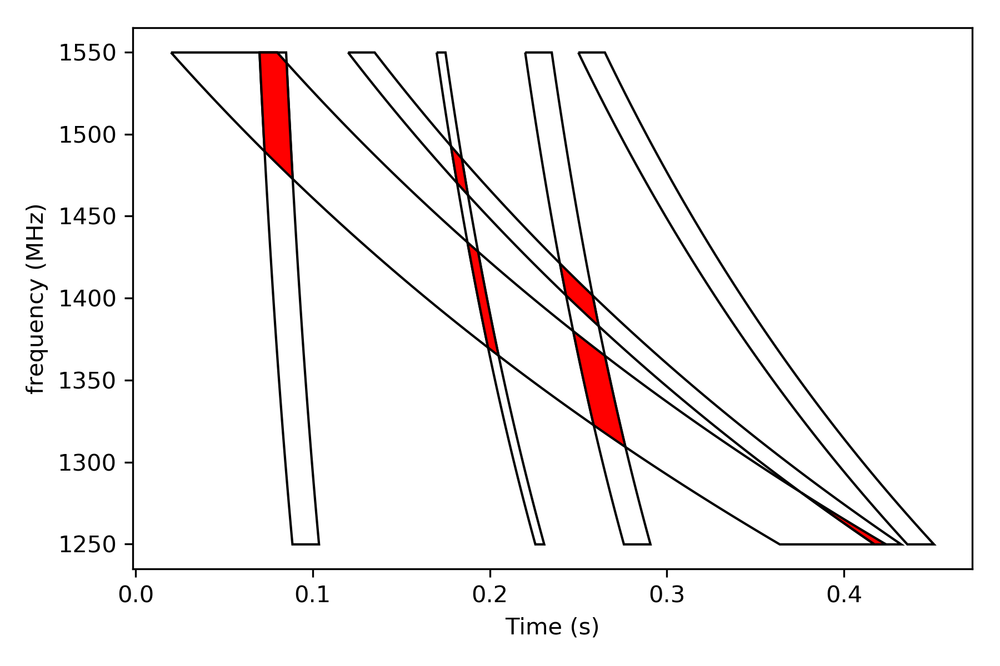

Examples
========

Filtering
----------------

For this example we first generate a pandas DataFrame with random dummy trigger data.
Typically you would read the data from from a file: `data = pd.read_csv(...)`.

.. code-block:: python

    import pandas as pd
    import random

    N = 1000  # Number of random triggers

    # Generate a Pandas Data Frame with random trigger data
    data = pd.DataFrame(
        [
            [
                random.uniform(0.0, 1.0),
                random.uniform(0.0, 0.01),
                random.uniform(0.0, 100.0),
                random.uniform(5.0, 10.0),
                i
            ]
            for i in range(N)
        ],
        columns=['t', 'w', 'DM', 'SNR', 'counter']
    )

Create a FilterEngine object and specify the observation frequency range.
The frequency range is needed so that the engine can compute if triggers overlap in the dynamic spectrum.

.. code-block:: python

    from astrotf.radio import FilterEngine

    # Initialize a filter egine
    eng = FilterEngine(freq_lo_mhz=1249.8, freq_hi_mhz=1549.8)

Sorting
^^^^^^^^^

Before we process triggers, the triggers need to be sorted on pulse-start-time ascending and pulse-end-time descending.

* `pulse-start-time` is defined as the time the start of the pulse is observed at the highest frequency.
* `pulse-end-time` is defined as the end of the pulse observed at the lowest frequency.

This sorting can be done with the `sort()` member function.
There are 3 variant depending on the available data in the dataframe.

If you have pre-computed pulse start- and end-times in your DataFrame then you can use the variant below and specify the names of the two columns that contain the start and end time.

.. code-block:: python

    eng.sort(data, ['pulse_start', 'pulse_end'])

If you have don't have the pulse-end-times in your DataFrame then the next version will compute the end-time based internally on the pulse width, DM and frequency range.
The computed pulse-end-times will be stored as a new column `pulse_end` in the DataFrame.

.. code-block:: python

    eng.sort(data, ['pulse_start', 'pulse_width', 'DM'])

If you want to store the end-times in a  column with a different name, then specify that in an optional 4th column name.

.. code-block:: python

    eng.sort(data, ['pulse_start', 'pulse_width', 'DM', 'my_end_time_column'])

Filtering
^^^^^^^^^^

The `filter` member function is a generator that consumes an iterable set of tuples with trigger information
and yield a subset of those triggers.

The first 4 elements of the tuple needs to be:

* start time of the pulse
* width of the pulse
* dispersion measure
* signal to noise value

Additional tuple elements are allowed, in the example below we have added the counter column.

.. code-block:: python

    for filtered_trigger in eng.filter(
            (e.t, e.w, e.DM, e.SNR, e.counter)
            for e in data.itertuples()
        ):
        print(filtered_trigger)

Output::

    (0.0023, 0.0071, 7.977, 8.362, 633)
    ...
    (0.9910, 0.0061, 42.784, 9.598, 993)
    (0.9995, 0.0001, 94.495, 5.4295, 49)

Statistics
^^^^^^^^^^

The FilterEngine keeps track of basic statistics, the number of triggers processed and returned.

.. code-block:: python

    print('Filtered {} triggers out of a set of {}'.format(eng.num_out, eng.num_in))

Output::

    Filtered 246 triggers out of a set of 1000

Plotting pulses
---------------

.. code-block:: python

    from astrotf.radio import FilterEngine

    import matplotlib.pyplot as plt
    import shapely.geometry as sg
    import descartes

    # A list of triggers: t0, width, DM
    triggers = [
        (0.02, 0.060, 370),
        (0.07, 0.015, 20),
        (0.12, 0.015, 320),
        (0.17, 0.005, 60),
        (0.22, 0.015, 60),
        (0.25, 0.015, 200)
    ]

    eng = FilterEngine(freq_lo_mhz=1249.8, freq_hi_mhz=1549.8)

    fig, ax = plt.subplots(1, 1, figsize=(6,4), sharex=True, sharey=True)

    # Plot the templates
    for trigger in triggers:
        p = sg.Polygon(eng.polygon(*trigger))
        ax.add_patch(descartes.PolygonPatch(p, fc='w', ec='k'))

    # Plot the overlapping regions
    for i in range(len(triggers)):
        p_i = sg.Polygon(eng.polygon(*triggers[i]))
        for j in range(i+1, len(triggers)):
            p_j = sg.Polygon(eng.polygon(*triggers[j]))

            if p_i.intersects(p_j):
                p_ij = p_i.intersection(p_j)
                ax.add_patch(descartes.PolygonPatch(p_ij, fc='r', ec='k'))

    # Styling the plot
    ax.autoscale_view()
    plt.xlabel('Time (s)')
    plt.ylabel('frequency (MHz)')
    plt.tight_layout()
    plt.savefig('output/example_plotting.png', dpi=300)

