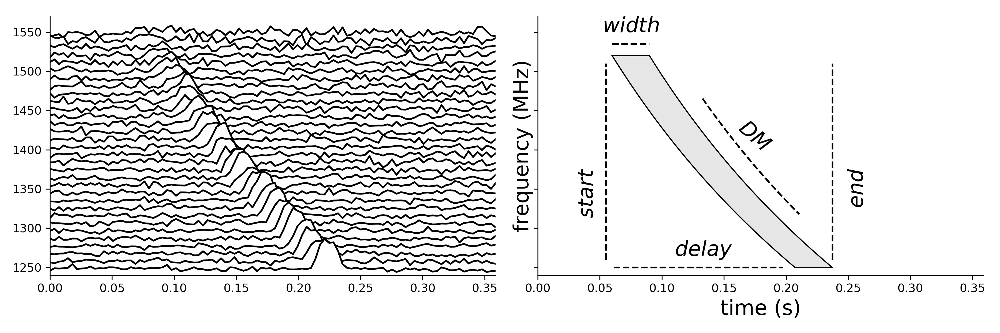
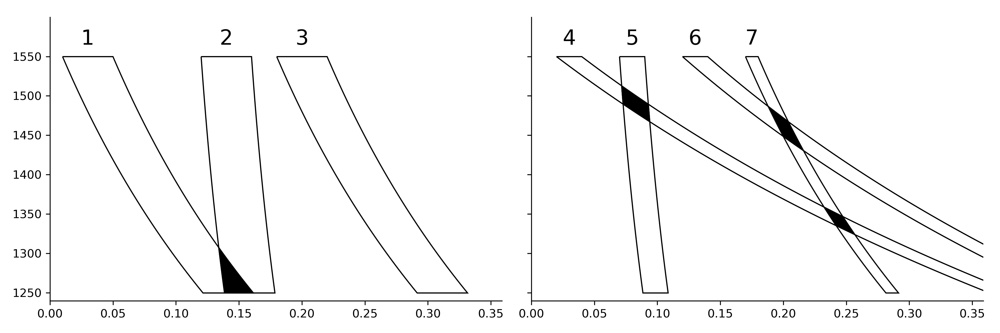

Astronomical Trigger Filtering
===================================

This package provides algorithms for reducing the number of superfluous triggers that occur in matched template searches pipelines use in astronomy.

Requirements
------------

* Python 2.7, 3.5, 3.6 or 3.7

.. toctree::
   :maxdepth: 2
   :caption: Contents:

   examples
   modules
   license

